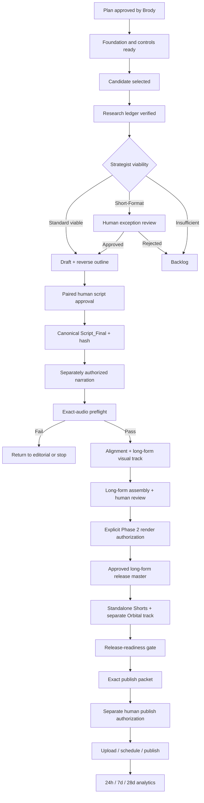

# Cold Truth Master Execution Plan

> [!IMPORTANT]
> This is the controlling, ordered handoff plan for building and operating Cold Truth with Codex. It is a plan, not an authorization to narrate, generate media, render, access providers, upload, schedule, or publish.

## Document control

| Field | Value |
|---|---|
| Plan version | `1.0` |
| Prepared | `2026-07-14` |
| Channel owner and human approver | Brody |
| Execution coordinator | Codex |
| Status | `APPROVED_V1_0` |
| Approval evidence | Brody: repeated “looks good, continue” direction in the controlling Codex task on `2026-07-14` |
| Approved source SHA-256 | `81C5B55132EB0BE13D20190E5C25E977EDB4CB6474863586C9333BA3488607A4` |
| Current operating mode | Planning, documentation, and separately authorized offline engineering only |
| Production mode | Disabled |
| Publishing | Disabled |
| Machine-readable companion | [[0_ADMIN/COLD_TRUTH_EXECUTION_STATE.json|Cold Truth Execution State]] |

Approval of this plan establishes the sequence and standards below. It does not satisfy any later human gate or authorize an external or production action. Codex must never treat silence, a filename, an earlier approval, a passing synthetic test, or completion of one stage as approval for the next stage.

## 1. Mission and finished outcome

Cold Truth will be a calm, reliable, faceless true-crime channel built primarily for women ages 25–45, especially background listeners and mothers. The channel should explain a case as one coherent story, distinguish confirmed facts from uncertainty, respect victims and families, and avoid sensationalism.

The operating system is complete only when it can repeatedly produce an episode with:

- a vetted, claim-level source ledger;
- an explicit long-form viability decision;
- a coherent reverse outline and narration draft approved together by Brody;
- at least `480.000` seconds of approved long-form narration audio, unless a valid human-approved Short-Format exception exists;
- a case-appropriate long-form visual track with traceable licenses;
- separately scripted Shorts with a separately licensed Orbital gameplay visual track;
- exact-input manifests, hashes, approvals, preflights, and QA records;
- a human-approved release master, thumbnail, and metadata package; and
- a separate, exact publishing authorization before any upload, scheduling, or publication.

Quality and trust take precedence over cadence. A case that cannot support eight useful minutes without padding moves to Short-Format review or the backlog.

## 2. Authority and conflict resolution

Codex must apply instructions in this order:

1. The current, explicit task from Brody, within its stated scope.
2. Repository `AGENTS.md` safety, editorial, and production rules.
3. [[0_ADMIN/CONTENT_FORMAT_STANDARD|Content Format Standard]], which is the locked format authority.
4. This master plan and [[2_CHANNEL_SYSTEM/WORKFLOW_PER_VIDEO|Workflow Per Video]].
5. Current role and skill instructions.
6. Older channel notes and historical episode artifacts, which are examples only.

When two sources conflict, Codex must follow the higher authority, record the conflict, and stop if the resolution would materially change the requested work.

### Resolved legacy conflicts

| Topic | Superseded guidance | Controlling rule |
|---|---|---|
| Long-form runtime | 10–15 minutes | Target 8–10 minutes; prefer 8:15–10:30; release minimum is `480.000` seconds of exact approved narration audio. |
| Draft length | 1,500–2,000 words | Normally 1,150–1,450 spoken words as an editorial aid only. Word count never proves runtime. |
| Shorts source | Cut down or reuse the long-form voiceover | Each Short gets a standalone, source-backed script and separately measured narration. |
| Visual reuse | Reuse material for efficiency | Long-form and Shorts are isolated visual tracks with zero shared visual assets. |
| Runtime correction | Slow speech, repeat, or add filler | No padding. Add only distinct, verified, ledger-supported substance or choose Short-Format/backlog. |
| Approval evidence | A file named `Script_Final.md` | A current, hash-bound record showing paired human approval of the reverse outline and full draft. |
| Synthetic milestones | Passing tests implies real permission | Synthetic/offline milestones authorize no provider, narration, runtime, asset, render, upload, or production action. |

Historical Jodi Huisentruit files may inform structure, but any historical under-eight-minute output, old approval, or file named “final” is not a precedent and is not automatically active under the current standard.

## 3. Current checkpoint

As of `2026-07-14`:

- The vault contains channel rules, role definitions, prompts, a backlog, candidate research packets, and a Jodi Huisentruit production record.
- The automation control plane includes deterministic case selection, state transitions, approval and invalidation logic, append-only manifests, track-isolation checks, and a dry-run/synthetic agent runtime.
- Real research-agent execution, narration, forced alignment, asset download/licensing, assembly, render, upload, and publishing adapters are not production-ready.
- `real_production_enabled` must remain `false`; publishing remains unimplemented or disabled.
- The synthetic C3 fixture is exactly `AWAITING_SCRIPT_APPROVAL`. It is not approval for a real episode. No C4 approval exists.
- L7F is regression-certified: `373/373` passed. L7G's concrete sealed-interpreter boundary and its order-assertion repair are certified, and L7H's canonical one-time caller is certified: `389/389` passed.
- No fresh L8 authorization or attempt is approved. Any future L8 work requires a separately scoped repair/certification task, human review, and then a new exact one-time authorization.
- Brody approved master plan version `1.0` for adoption and documentation normalization. This approval authorizes no production stage, provider, media, L8 execution, or publishing action.

## 4. Non-negotiable operating rules

### Editorial truth and tone

- A suspect claim may enter narration only when corroborated by law enforcement, a charging document, or a court finding.
- Private-investigator claims, tips, rumors, and speculation may appear only when necessary and explicitly labeled unverified.
- Every factual narration claim must map to the source ledger. If support is ambiguous, omit or qualify it.
- Prefer sources in this order: court records and charging documents; law-enforcement or other official records; direct public records; then reputable reporting for context. A secondary article cannot silently upgrade an allegation into a verified fact.
- Record conflicting accounts side by side in the ledger. The script may describe the disagreement only when the sources and limits are clear; it must not choose the more dramatic version by default.
- Use calm, chronological, plain-language storytelling. Do not invite theories, dramatize, invent interior states, or use unsupported motives.
- Protect dignity: avoid graphic treatment, victim-blaming, and misleading images of identifiable people or locations.
- Every long-form script needs a purposeful hook, essential setup, chronological event narrative, investigation/evidence context, verified current status, and respectful conclusion.
- Repetition scanning is not an editorial pass. The episode must work as one understandable spoken story for a first-time background listener.

### Runtime and format

- Every narration request declares either `youtube-longform` or `shorts`.
- Long-form target: 8–10 minutes; preferred range: 8:15–10:30.
- Long-form release floor: `480.000` seconds of exact approved audio.
- `480.000–494.999` seconds may pass but is flagged; `495.000–630.000` is preferred; above `630.000` requires editorial review.
- A long-form result below `480.000` seconds is blocked unless Brody approved a machine-documented `short-format` exception and the Production Summary says `Short-Format`.
- Shorts target 30–60 seconds and may not exceed `60.000` seconds without a machine-documented human exception.
- Standard episodes produce 3–5 strong Shorts. Approved Short-Format episodes may produce 1–2.
- Actual FFprobe-measured audio duration is authoritative. Word count and projected reading time are planning aids only.

### Media isolation and authorization

- Long-form uses case-appropriate landscape B-roll and case graphics.
- Shorts use a separately licensed Orbital gameplay background with factual overlays in a 9:16 composition.
- No visual file, timeline reference, asset ID, or derivative may be shared between the two tracks.
- A visual timeline is not ready until every required long-form clip is downloaded and verified and the licensed Shorts gameplay source exists locally.
- Direct/manual generation is allowed only when the direct-generation manifest records the tool, timestamp, settings, exact inputs, and every output path.
- No narration, alignment, visual sourcing, Shorts derivation, assembly, render, upload, schedule, or publish action may begin before its own prerequisites and approval gate.
- No final visual media may be generated and no video may be rendered or uploaded without explicit Phase 2 authorization.

### Narration baseline

- The currently documented production profile is Mia through ElevenLabs using `eleven_multilingual_v2`, stability `.72`, similarity `.76`, style `.05`, speed `.94`, speaker boost enabled, and `mp3_44100_128`. [[2_CHANNEL_SYSTEM/NARRATION_VOICE|Narration Voice]] remains the canonical profile record.
- Listing the profile here is not provider access or generation authorization. The exact voice ID, settings, script hash, target format, path, and attempt limit must be bound into each approved request.
- Piper `1.4.2` with `en_US-ljspeech-high` is currently an isolated synthetic-evaluation route only. It is not approved as the channel’s production narrator, and its synthetic authorization path must never use Cold Truth scripts, cases, research, people, personal information, C3, or C4.
- Switching provider, voice, model, language, format, or fallback behavior requires Brody’s explicit approval and a versioned update to the narration profile and affected contracts.

## 5. Roles and decision rights

| Role | Responsible for | May approve its own work? |
|---|---|---:|
| Brody | Channel direction, exceptions, paired script approval, media execution, creative master, thumbnail, and publication | Yes; sole human authority |
| Codex coordinator | Read state, enforce order, dispatch one bounded stage, validate handoffs, update records, stop at gates | No |
| Strategist | Candidate research, scoring, source ledger, risk notes, viability decision | No |
| Research verifier | Claim-to-source review and admissibility classification | No |
| Writer | Ledger-bound long-form narration draft | No |
| Editor | Reverse outline, coherence, factual/tonal/pacing edit, exclusion list, narrative QA | No |
| Narration operator | Exact-script voice request, generation, QA evidence, duration preflight | No |
| Visual producer | Long-form shot list, sourcing ledger, license and visual QA | No |
| Shorts editor | Standalone Short scripts, overlays, separate narration and Orbital timelines | No |
| Assembly operator | Exact-input previews, technical QA, render evidence | No |
| Upload manager | Metadata, thumbnail brief, release checklist, blocked upload manifest | No |

One person or Codex instance may perform several roles, but the artifacts, contracts, and gates remain separate. Codex prepares approval packets; it never impersonates Brody or records human approval without an explicit message.

## 6. Master lifecycle



Every arrow is conditional. A downstream stage may start only when the current state file and the episode Production Summary both identify it as the single next allowed stage.

## 7. Channel-build roadmap

### Foundation 0 — Adopt the operating plan

**Goal:** establish one source of truth before more implementation or production.

Tasks:

1. Brody reviews this plan and either approves it by version/hash or requests amendments.
2. Codex records the approval without expanding its scope.
3. Codex normalizes older role, channel-system, prompt, and workflow notes against the locked format standard. Historical guidance is marked superseded rather than silently erased.
4. Codex verifies that the vault index links the controlling plan, state, standards, roles, active episode records, and audit reports.

Pass condition: no active instruction conflicts remain, and the state file says `PLAN_APPROVED`.

Stop condition: a conflict changes editorial standards, budget, provider, account behavior, media creation, or publication. Return it to Brody.

### Foundation 1 — Brand and governance kit

**Goal:** define a recognizable, respectful channel before public setup.

Create or approve:

- one-sentence channel promise and longer About description;
- tone and vocabulary guide for calm, source-forward narration;
- logo/avatar, banner, color, type, and thumbnail system briefs;
- source attribution, corrections, privacy, graphic-content, and AI-assistance policies;
- music, footage, graphics, gameplay, font, and model/license rules;
- folder naming, case IDs, episode IDs, Short IDs, retention, and backup policy;
- account ownership, recovery, and least-privilege checklist, without storing secrets in the vault; and
- a copyright/claims response procedure.

Pass condition: Brody approves the brand brief and governance checklist. Creating or changing an actual account, channel page, or platform setting remains a separate authorization.

### Foundation 2 — Automation control plane

**Goal:** make state and gates deterministic before connecting real tools.

Required controls:

- versioned input/result contracts for every role and adapter;
- one orchestrator as the sole state owner;
- stable `run_id`, `case_id`, `episode_id`, `stage`, `attempt`, and idempotency key;
- canonical paths and SHA-256 hashes for every active input and output;
- append-only `Automation/pipeline_manifest.json`;
- structured, hash-bound human approvals with purpose, scope, expiry where relevant, and consumed state;
- automatic invalidation of downstream work when an upstream hash changes;
- dry-run by default and `real_production_enabled: false`;
- explicit track labels and a zero-intersection long-form/Shorts asset check;
- bounded attempts, no provider fallback, and fail-closed errors; and
- a status view that reports current state, blocker, last clean artifact, and exact next allowed action.

Pass condition: offline tests prove valid transitions, invalid-transition rejection, stale-approval rejection, idempotency, invalidation, track isolation, and blocked publication.

### Foundation 3 — Close the current offline engineering blocker

**Goal:** finish L7F certification without implying L8 permission.

Ordered work, each under a separate task authorization:

1. Human reviews the L7F report.
2. Authorize one minimal offline repair to the brittle L7/L7A/L7B static assertion; prefer a syntax/AST-aware check over substring matching.
3. Run the exact focused and unchanged regression chain once, in the accepted order, stopping at the first failure.
4. If all suites pass, report regression certification and stop for human review.
5. Only if Brody still wants the synthetic Piper connectivity test, write and approve a fresh, exact, one-time L8 authorization. The L8 action remains synthetic evaluation and does not approve Piper as the production voice.

Pass condition: a full clean regression report exists. No L8 action is part of this foundation unless separately authorized afterward.

### Foundation 4 — Real adapter readiness

**Goal:** implement one provider path per capability behind the proven gates.

Recommended order:

1. Real Codex role adapter for structured Strategist, Writer, and Editor handoffs.
2. Narration adapter bound to the approved provider/voice/settings and exact script hash.
3. FFprobe duration preflight.
4. WhisperX or approved forced-alignment adapter.
5. Long-form footage search/download/license adapter.
6. Separate Orbital license/ingest adapter for Shorts.
7. Timeline/assembly adapter.
8. Local render adapter.
9. Upload preparation adapter that remains blocked from actual publication.

Each adapter gets offline contract tests, fake integration tests, one bounded human-authorized connectivity test if needed, and a certification report before production use. No automatic fallback may switch a provider, model, voice, case, or asset source.

### Foundation 5 — Launch readiness

**Goal:** begin public release with a stable buffer rather than a one-off video.

Recommended launch buffer:

- three fully approved long-form release masters;
- at least two strong, approved Shorts per launch episode, with 3–5 preferred for standard episodes;
- finalized channel branding and About copy;
- a verified rights ledger for every active media file;
- approved metadata and thumbnail packages;
- a corrections and claims procedure; and
- an eight-week editorial calendar with backup cases.

Recommended starting cadence is one long-form episode per week plus up to three strong Shorts from the approved backlog. This is a planning recommendation, not a reason to lower standards. Brody should review capacity and analytics after eight weeks.

## 8. Per-episode execution workflow

The following stages are strictly ordered. “Output” means the canonical active artifact plus its manifest entry; prose alone cannot advance state.

| ID | Stage and owner | Required inputs | Canonical output and pass condition | Mandatory stop |
|---:|---|---|---|---|
| E00 | Initialize — Codex | Approved case task | `Production_Summary.md`, episode IDs, empty append-only manifests; all media stages blocked | Duplicate ID, unsafe path, or missing scope |
| E01 | Candidate selection — Strategist | Backlog, selection rubric | Scorecard and selected case with rationale | Brody excluded case or unresolved sensitivity |
| E02 | Research ledger — Strategist | Approved research scope | `Research_Source_Ledger.md` with claim, source, source type, location, date, quote/paraphrase, admissibility, confidence, conflicts | Missing provenance, unsupported suspect claim, or ambiguous identity |
| E03 | Research verification — verifier | Source ledger and primary documents | Each narration-eligible claim marked verified, qualified, or excluded | Any material claim lacks admissible support |
| E04 | Viability — Strategist | Vetted ledger | Exactly one: `Standard long-form viable`, `Short-Format exception — requires human approval`, or `Backlog — insufficient long-form material` | No explicit result or padding would be required |
| E05 | Exception gate — Brody | Short-Format packet, reason, expected scope | Machine-readable approval or rejection bound to case and ledger hash | No approval; return to backlog |
| E06 | Long-form draft — Writer | Viable vetted ledger, audience/tone rules | `Script_Draft.md`, normally 1,150–1,450 spoken words, with claim references and no invented connective facts | Any paragraph cannot be supported or does not serve the story |
| E07 | Reverse outline and edit — Editor | Draft and vetted ledger | `Editorial/Reverse_Outline.md`, `Editorial_Notes.md`, revised full draft, narrative QA, exclusions; every section has purpose, support, and transition | Fact-card structure, repetition, unsupported inference, missing current status, or failed coherence |
| E08 | Paired script approval — Brody | Exact reverse outline and exact full draft | Hash-bound approval of both documents together | Partial, stale, inferred, or file-name-only approval |
| E09 | Canonical script — Codex | Valid paired approval | `Script_Final.md` created from the exact approved draft; path, hash, approval ID, and exclusions logged | Any byte differs from approved content |
| E10 | Narration request — operator | Current script hash, target `youtube-longform`, exact voice config, C3/C4 plus separate execution authority | Structured request with output path, attempt limit, and approval bindings | Missing/stale authority, provider mismatch, fallback, or unapproved text |
| E11 | Narration and human audio QA — operator/Brody | Authorized exact request | One active audio file; manifest records provider, settings, time, attempts, path/hash/size; QA covers omissions, duplication, pronunciation, pauses, peaks, tone, and exact-script match | Any script mismatch, defect, second attempt without authority, or provider change |
| E12 | Runtime preflight — machine | Exact active narration | `Automation/preflight.json` with FFprobe audio-stream duration, exact path/hash, `word_count_used_for_duration: false`, and `assembly_allowed: true` | Below floor without valid exception, wrong file, or failed probe |
| E13 | Forced alignment — operator | Passing preflight and exact audio/script | `Assembly/WhisperX/<audio-id>.json`; verified opening/closing coverage and useful word anchors | Stale audio/script, missing coverage, or unlogged tool/settings |
| E14 | Long-form visual plan — Visual Producer | Final script, exact alignment, source ledger | `Shot_List.md` and/or `YouTube_Visual_Timeline.md`; each beat has time window, spoken cue, visual, 3–5 search queries, duration, overlay, and safety notes | Orbital/gameplay reference, graphic/misleading visual, weak hook, or unmapped section |
| E15 | Long-form plan approval — Brody | Exact visual plan | Hash-bound approval for sourcing scope | No approval or changed timeline |
| E16 | Long-form asset sourcing — Visual Producer | Approved plan and separate sourcing authority | Files only under `footage/`; sourcing ledger records provider ID, creator, URL/license, query, local path/hash, dimensions, duration, and beat | Unverified license, unsafe content, poor substitute, network not authorized, or any Shorts asset |
| E17 | Long-form assembly preview — Assembly operator | Exact approved audio/preflight/alignment/assets | Editable project/FCPXML and `Assembly/Assembly_Review.md`; contiguous, no source overruns, no stale inputs, no gaps, full license traceability | Any technical defect, stale input, unlicensed asset, or cross-track reference |
| E18 | Long-form creative review — Brody | Whole preview and QA packet | Approval or bounded revision notes bound to project/input hashes | Preview rejection; return to the owning stage |
| E19 | Render authorization and long-form master — Brody/operator | Approved preview and explicit Phase 2 render authority | One active release master; verified streams, dimensions, frame rate, sync, full playback, timing, and no black gaps/truncation/wrong overlays | No explicit render authority or failed technical/creative QA |
| E20 | Standalone Shorts package — Shorts Editor | Approved `Script_Final.md`, vetted ledger, and approved long-form edit by default | `Shorts_Package.md`; 3–5 standard or 1–2 Short-Format scripts, each one sourced idea, <150 words, factual hook, overlays, unresolved but non-speculative exit | Theory invitation, suspect implication, unsupported context, first-person opening, or reused long-form audio |
| E21 | Short script approvals — Brody | Exact script and overlay packet per Short | Separate hash-bound approval for each Short | Batch or inferred approval that cannot identify exact text |
| E22 | Short narration/preflight/alignment — operator | Approved exact Short script and separate execution authority | Separate audio, preflight, and alignment per Short; 30–60 seconds unless approved exception | >60 seconds without exception, stale text, provider fallback, or shared long-form media |
| E23 | Orbital ingest — Shorts Editor | Separate license/ingest authority | File only under `shorts_gameplay/`; ledger includes creator/product, terms/purchase evidence, required credit, path/hash/properties, `shorts_only_asset: true`, `shared_with_long_form: false` | License uncertainty, missing local source, or any long-form use |
| E24 | Shorts timelines/previews — Shorts Editor | Exact Short audio/alignment and licensed gameplay | 9:16 timeline per Short with every overlay mapped to a spoken anchor, safe-area readability, credit, and `shared_assets: false` | Any long-form asset, timing defect, unreadable overlay, or wrong audio |
| E25 | Shorts render and QA — Brody/operator | Approved previews and explicit Phase 2 media authority | Active Short masters with full technical and creative QA | No render authority, >60 seconds without exception, or failed QA |
| E26 | Metadata — Upload Manager | Final script, active masters, source ledger | `Metadata.md` plus `Shorts_Metadata.md`; factual titles/descriptions/tags/source links/credits; no unsupported implication | Clickbait, misleading claim, missing source/Orbital credit, or merged track metadata |
| E27 | Thumbnail — Upload Manager/designer | Approved brief and separate generation authority | Three concepts, generated variants if authorized, human-selected canonical path/hash | Misleading face/evidence, graphic treatment, poor small-size readability, or no human selection |
| E28 | Release-readiness gate — Codex/Brody | All active artifacts and approvals | Checklist passes: exact hashes, preflights, creative masters, licenses, track isolation, metadata, thumbnail, and no stale component | Any missing, stale, unapproved, unlicensed, or cross-track item |
| E29 | Upload packet — Upload Manager | Passed release gate | Local `Automation/upload_manifest.json` in blocked state with exact master/thumbnail/metadata hashes, target channel, visibility, and requested schedule | Upload implementation absent, account ambiguity, or no exact publish approval |
| E30 | Publish authorization — Brody | Exact upload packet | Separate one-time authority binding channel, files, metadata, visibility, schedule/timezone, and allowed action | Silence, old approval, changed hash, or broader-than-needed authority |
| E31 | Upload/schedule/publish — operator | Implemented certified adapter and valid exact authority | Platform IDs/URLs, processing checks, captions/sync, rights checks, end screens/cards, final state logged | Wrong account/file/settings, copyright issue, processing defect, or any unauthorized action |
| E32 | Analytics — Strategist | Published IDs and approved measurement scope | 24-hour, 7-day, and 28-day snapshots plus one evidence-based next-batch recommendation | Cross-track data conflation or sensational recommendation |

The default sequence completes and creatively approves the long-form edit before producing Shorts. Brody may later authorize safe parallel planning, but the paired script approval, exact-input bindings, isolated tracks, and individual media gates still apply.

## 9. Artifact and folder contract

Use one canonical episode directory. Preserve superseded files for audit, but remove their active status.

```text
2_IN_PRODUCTION/<Case>/
├── Production_Summary.md
├── Research_Source_Ledger.md
├── Strategist_Viability.md
├── Script_Draft.md
├── Script_Final.md
├── Editorial/
│   ├── Reverse_Outline.md
│   ├── Editorial_Notes.md
│   └── Narrative_QA.md
├── Shot_List.md
├── YouTube_Visual_Timeline.md
├── Shorts_Package.md
├── Shorts_Visual_Timeline.md
├── Metadata.md
├── Shorts_Metadata.md
├── footage/                    # long-form only
├── shorts_gameplay/            # Shorts only
├── Thumbnails/
├── Assembly/
│   ├── WhisperX/
│   └── Assembly_Review.md
├── Renders/
├── Analytics/
└── Automation/
    ├── script_approval.json
    ├── preflight.json
    ├── pipeline_manifest.json
    ├── direct_generation_manifest.json
    └── upload_manifest.json
```

Every machine handoff must contain:

- contract name and version;
- run, case, episode, stage, attempt, and idempotency identifiers;
- exact canonical input paths and SHA-256 hashes;
- exact expected output paths;
- permissions granted and actions explicitly forbidden;
- relevant approval IDs and bound hashes;
- result schema, QA evidence, and stop reason; and
- the only allowed next state.

`Production_Summary.md` is the human-readable state ledger. For each component it records status, canonical path, hash, approval binding, QA result, supersession state, blocker, and next allowed action. `Automation/pipeline_manifest.json` is append-only. A manual action additionally appends `Automation/direct_generation_manifest.json` with tool, timestamp, settings, exact inputs, every output, and verification.

## 10. Approval matrix

| Gate | Required human decision | What the approval must bind | What it does not authorize |
|---|---|---|---|
| G00 Plan | Approve or amend plan v1.0 | Plan version/hash | Research, media, providers, production, or publishing |
| G01 Case/scope | Approve selected case where requested | Case ID and allowed research scope | Claims in narration |
| G02 Short-Format | Approve exception | Case, ledger hash, reason, expected runtime, expiry/scope | Padding or automatic media work |
| G03 Paired script | Approve reverse outline and full draft together | Both paths/hashes, exclusions, episode ID | Narration or any Phase 2 action |
| G04 Narration | Approve exact generation | Script hash, provider/model/voice/settings, output, attempts, target format | Visuals, render, upload, retries, fallback |
| G05 Visual sourcing | Approve exact sourcing scope | Timeline hash, providers, roots, budget/license limits | Render or use outside the assigned track |
| G06 Assembly | Approve whole edit | Project/input hashes and revision | Render, upload, or publish |
| G07 Render | Approve exact Phase 2 render | Project hash, outputs, settings, attempt limits | Upload or publication |
| G08 Release master | Creatively accept active master | Master path/hash and associated QA | Platform action |
| G09 Publish | Approve exact platform action | Account/channel, files/hashes, metadata, visibility, schedule/timezone | Future videos, retries, edits, or republishing |

An approval is invalid when its input hash, purpose, target, scope, expiry, consumption state, or prerequisite state does not match. Codex must fail closed and report the mismatch.

## 11. Invalidation and revision rules

- A source-ledger change reopens research verification and viability, then invalidates every affected downstream claim and artifact.
- A reverse-outline or draft change invalidates paired approval and `Script_Final.md`.
- Any `Script_Final.md` change invalidates narration, preflight, alignment, visual timing, assembly, renders, derived Shorts, and affected metadata.
- Any narration change invalidates preflight, alignment, timed visuals, assemblies, and renders.
- Any alignment change invalidates timed visual and overlay mappings, assemblies, and renders.
- Any visual asset or timeline change invalidates track-isolation verification, assemblies, and renders for that track.
- Any metadata or thumbnail change after publish approval invalidates that publish approval.
- A technical retry is a new attempt. It needs remaining authorized attempts or a new authorization; a failure never silently widens scope.
- Superseded files remain `SUPERSEDED — AUDIT ONLY`. They must not be overwritten, relabeled active, or used as fallback.

## 12. Production quality checks

### Long-form visual QA

- Landscape, quiet documentary tone, case-appropriate, and visually useful in the opening hook.
- Prefer edits on breath or sentence boundaries.
- Avoid unmotivated shots longer than 20–25 seconds; flag anything over 30 seconds without a deliberate cue.
- No graphic footage, unsafe identifiable private location, misleading face, invented evidence, or casual use of real victim/crime-scene imagery.
- Every clip has a license/source record and maps to a timed beat.
- No Orbital or Shorts gameplay file appears anywhere in the long-form dependency graph.

### Shorts QA

- One factual idea per Short; statement hook under 15 words where possible.
- Every name, date, location, and key fact appears as a readable overlay anchored to aligned speech.
- 9:16 safe-area composition, correct crop, exact current audio, passing duration preflight.
- Licensed Orbital gameplay only; exact credit included where required.
- No theory invitation, unsupported implication, reused long-form audio, or long-form visual asset.

### Packaging QA

- Long-form: three title candidates under 60 characters; a factual 150–250-word description; safe source links; 15–20 useful tags; two thumbnail text options of 2–5 words.
- Shorts: distinct concise title/description, full-episode pointer when appropriate, and exact Orbital credit.
- Thumbnails are calm, documentary, readable small, non-graphic, and never imply a suspect, quote, event, or piece of evidence that the episode cannot support.
- Platform-specific settings must be rechecked against the live platform at the time of an authorized upload; this plan does not assume those settings remain unchanged.

## 13. Analytics and improvement loop

Keep long-form and Shorts analytics separate. Record snapshots at 24 hours, 7 days, and 28 days.

Long-form measures:

- impressions and click-through rate;
- first 30-second and first-minute retention;
- average view duration and average percentage viewed;
- retention exits by story section;
- watch hours, traffic sources, returning viewers, and subscriber contribution; and
- performance by case type, hook structure, runtime, title, and thumbnail pattern.

Shorts measures:

- viewed versus swiped away;
- average view duration and percentage viewed;
- rewatch/loop behavior;
- engagement and subscriber contribution; and
- click-through or discovery contribution to the related long-form episode.

Interpretation rules:

- Low click-through with healthy retention suggests a packaging problem.
- Strong click-through with weak early retention suggests a title/thumbnail promise or hook mismatch.
- Mid-video exits clustered at one section suggest coherence, pacing, or explanation problems.
- Change one meaningful variable per batch where possible.
- Analytics never justify exaggeration, unsupported claims, graphic treatment, or lower source standards.

Brody must approve and the manifest must record any post-publication title or thumbnail change.

## 14. Definitions of done

### Channel launch-ready

- Plan and governing documents are approved and internally consistent.
- Brand/governance kit, rights policy, corrections process, folder rules, and account-safety checklist are approved.
- Automation gates have certified offline tests and real adapters required for the chosen workflow are separately certified.
- Production and publishing remain disabled by default and fail closed.
- The launch buffer meets Brody’s approved quantity and every episode independently passes release readiness.
- A final human review confirms the exact channel/account configuration and first release schedule.

### Episode release-ready

- Vetted source ledger and explicit viability result exist.
- Reverse outline and full draft have paired, hash-bound human approval.
- Canonical script, exact narration, preflight, alignment, visual assets, licenses, timelines, assemblies, masters, metadata, and thumbnail are current and traceable.
- Long-form audio is at least `480.000` seconds or has a valid Short-Format exception.
- Every Short is 30–60 seconds or has its own valid exception.
- Long-form and Shorts dependency graphs have zero shared visual assets.
- No component is stale, unresolved, unlicensed, audit-only, or waiting on QA.
- Release-readiness passes. Upload and publication are still blocked until G09.

### Published and closed

- Exact publish authorization was valid and consumed once.
- Correct account, files, metadata, thumbnail, visibility, schedule, captions, credits, and platform processing were verified.
- Platform IDs/URLs and exact uploaded hashes are recorded.
- 24-hour, 7-day, and 28-day analytics reviews are scheduled or complete.
- Corrections, rights claims, or post-publication changes are logged through their own human-approved workflow.

## 15. Codex operating protocol

For every future handoff, Codex must:

1. Read `AGENTS.md`, this plan, the machine-readable state file, the controlling standard, and only the inputs relevant to the assigned stage.
2. State the current checkpoint, requested stage, permissions, forbidden actions, and expected stop condition before acting.
3. Check that the prior stage is a clean pass. Distinguish a clean pass, correct fail-closed behavior, incomplete run, and real regression.
4. Refuse to advance on prose-only output, stale hashes, missing approvals, ambiguous paths, or an already consumed one-time authority.
5. Execute only the bounded stage in the task. Do not repair, retry, expand scope, connect a provider, or cross into the next phase unless explicitly allowed.
6. Preserve existing user changes and audit history. Never silently overwrite a canonical or superseded artifact.
7. Run proportionate offline verification. Stop immediately at the first required failure when the task is fail-fast.
8. Update the relevant artifact status and state record only if the task authorizes those writes.
9. Report exact inputs, invocations/actions, outputs, counts, hashes where required, first stop point, side effects, and remaining blocker.
10. End at the human gate with one paste-ready next-task prompt. Never describe a future action as already authorized.

## 16. Ordered immediate queue

1. **Brody review:** approve or amend this master plan.
2. **Documentation normalization:** update conflicting legacy channel/role/prompt notes to point to the locked standard and this plan; documentation only.
3. **L7F repair authorization:** permit one minimal offline test repair, then one exact fail-fast validation chain.
4. **Fresh L8 human review, optional:** only after complete L7F certification and only if Brody still wants the synthetic Piper check.
5. **Control-plane hardening:** complete versioned contracts, approval binding, invalidation, and status reporting in dry-run.
6. **Brand/governance kit:** create briefs and policies; no account or platform mutation.
7. **Editorial pilot:** run the selected case only through verified research, viability, draft, reverse outline, and paired human script review.
8. **Real adapter certification:** add one capability at a time behind separate approvals.
9. **Phase 2 pilot:** after explicit authorization, produce one complete local episode and its isolated Shorts package; stop before upload.
10. **Launch-buffer production:** complete Brody’s approved buffer and pass release readiness for each episode.
11. **Publishing pilot:** separately authorize the exact first upload/schedule action.
12. **Eight-week review:** adjust cadence, packaging, and case mix from evidence without weakening standards.

## 17. Paste-ready handoff template

Use this template for every Codex task. Replace bracketed values and delete permissions that are not needed.

```text
COLD TRUTH — [STAGE NAME]

Controlling files:
- AGENTS.md
- Brody's Vault/0_ADMIN/COLD_TRUTH_MASTER_EXECUTION_PLAN.md
- Brody's Vault/0_ADMIN/COLD_TRUTH_EXECUTION_STATE.json
- [stage-specific contract/input files]

Current checkpoint:
- Plan version: [version/hash]
- Episode/run: [episode_id/run_id or N/A]
- Current state: [exact state]
- Last clean artifact: [path/hash]
- Existing blocker: [blocker or none]

Authorized objective:
[One bounded outcome only.]

Allowed actions:
1. [Exact read/write/test/action]
2. [Exact read/write/test/action]

Forbidden actions:
- Do not infer approval for the next stage.
- Do not retry, repair, connect providers, access secrets, generate media,
  render, upload, schedule, publish, or change production state unless one of
  those actions is explicitly listed above.
- Preserve long-form/Shorts visual isolation and all audit history.

Required outputs:
- [Exact artifact paths]
- [Required report fields, hashes, counts, and confirmations]

Validation and stop rule:
- Run [exact validation] once.
- Stop at [human gate / first failure / exact terminal state].
- End with the exact next paste-ready prompt; do not execute it.
```

### First handoff after Brody approves this plan

```text
COLD TRUTH — MASTER PLAN ADOPTION + LEGACY DOCUMENT NORMALIZATION
DOCUMENTATION ONLY; NO PRODUCTION OR EXTERNAL ACTION

Read AGENTS.md, Brody's Vault/0_ADMIN/CONTENT_FORMAT_STANDARD.md,
Brody's Vault/0_ADMIN/COLD_TRUTH_MASTER_EXECUTION_PLAN.md, and
Brody's Vault/0_ADMIN/COLD_TRUTH_EXECUTION_STATE.json.

Brody approves master plan version 1.0 [insert approved SHA-256 or explicitly
approved version]. Record that approval, then audit the maintained channel,
role, workflow, and reusable-prompt notes for conflicts with the locked format
standard and master plan. Make only documentation changes needed to mark old
rules superseded and link the controlling rules. Do not rewrite historical
episode artifacts.

Do not research a case, access the network or secrets, modify automation code
or tests, authorize or run L8, create C3/C4 approvals, connect a provider,
generate narration or media, source assets, render, upload, schedule, publish,
or enable production.

Create one documentation-normalization report listing every file reviewed,
every conflict found, every change made, unchanged authoritative files, and
the remaining first blocker. Update the execution-state file only to record
the approved plan and the next authorized checkpoint. Stop for Brody review
and provide the next paste-ready prompt without executing it.
```

---

**Current human gate:** review the completed adoption and documentation-normalization report. Plan approval does not authorize L8, providers, narration, media, production, account access, or publishing.
