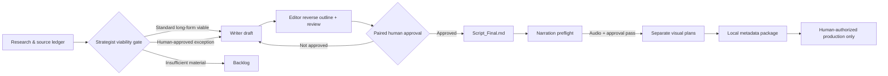

# Cold Truth

> A safety-first editorial system and local automation toolkit for a faceless true-crime YouTube channel.

Cold Truth is built for calm, reliable storytelling for women 25–45, including background listeners and mothers. It combines an Obsidian-friendly production vault with a Python control plane that makes editorial gates, approvals, handoffs, and audit records explicit.

The project is intentionally **not** an autonomous publishing system. Media generation, rendering, uploads, scheduling, and production-provider access remain blocked unless a human provides the required, documented authorization.

## What is here

| Area | Purpose |
| --- | --- |
| [`Brody's Vault/`](<Brody's Vault/>) | The editorial workspace: channel rules, ideas, research, scripts, production packets, and templates. |
| [`automation/`](automation/) | The Python control plane, contracts, fixture suites, safety gates, and local validation utilities. |
| [`skills/`](skills/) | Reusable Codex role skills for research strategy, writing, editing, visuals, Shorts, and metadata. |
| [`thumbnails/`](thumbnails/) | Non-production thumbnail prompt fixtures. |
| [`AGENTS.md`](AGENTS.md) | Project-wide operating rules for people and agents. |

## The production model



Two visual tracks are mandatory and never share assets:

- **YouTube long-form:** case-appropriate B-roll and case graphics.
- **TikTok / YouTube Shorts:** separately licensed Orbital gameplay plus factual text overlays.

Read the full workflow in [docs/CONTENT_WORKFLOW.md](docs/CONTENT_WORKFLOW.md).

## Safety and editorial guarantees

- Suspect claims require law-enforcement, charging-document, or court corroboration. Tips, rumors, and private-investigator claims must be explicitly labeled unverified.
- Long-form narration normally requires at least **480 seconds** of the exact approved audio; word count never substitutes for measured duration.
- The Editor must create a source-bound reverse outline, and a human must approve that outline and the full draft together before `Script_Final.md` exists.
- Weak cases are not padded. They are either documented as a human-approved Short-Format exception or returned to the backlog.
- The automation suite is designed to fail closed: no implicit credentials, broad filesystem access, provider fallback, publishing, or production action.

The controlling rules live in [`Brody's Vault/0_ADMIN/CONTENT_FORMAT_STANDARD.md`](<Brody's Vault/0_ADMIN/CONTENT_FORMAT_STANDARD.md>) and [`AGENTS.md`](AGENTS.md).

## Repository guide

Start with the document that matches what you need:

- [Repository architecture](docs/ARCHITECTURE.md) — components, contracts, state, and safety boundaries.
- [Editorial workflow](docs/CONTENT_WORKFLOW.md) — how a case moves from idea to a human-approved production packet.
- [Testing guide](docs/TESTING.md) — safe local checks and the scope of the fixture suites.
- [Automation README](automation/README.md) — implementation-level notes and phase-by-phase validation history.
- [Vault index](<Brody's Vault/0_ADMIN/VAULT_INDEX.md>) — the editorial workspace map.

## Quick validation

The test suite is stdlib-oriented and uses disposable synthetic fixtures. From the repository root:

```powershell
python -B automation/test_orchestrator.py
python -B automation/test_agent_runtime_orchestration.py
python -B automation/test_track_isolation.py
python -B automation/test_script_approval_gate.py
python -B automation/test_narration_preflight_gate.py
```

See [docs/TESTING.md](docs/TESTING.md) for the broader validation matrix. These checks do not create media, call a live provider, or publish content.

## Status

The repository contains a documented local control plane and synthetic validation coverage. It is **not production-enabled**: `automation/runtime_config.json` keeps production execution disabled, and the project’s governing documents require explicit human authorization before any real narration, media acquisition, rendering, upload, or scheduling.

## Contributing

Keep the guardrails intact. Do not add credentials, generated media, production-provider settings, or publishing credentials to the repository. Review [`AGENTS.md`](AGENTS.md), preserve the two-track visual rule, and run the relevant fixture tests before proposing a change.
